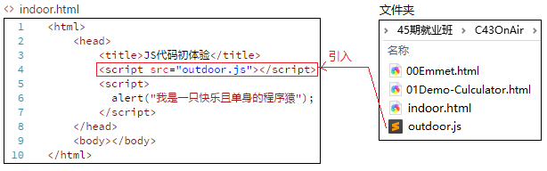
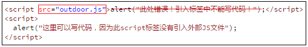
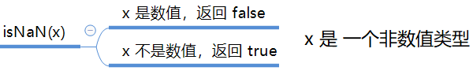

# JS第一天

## 1.今日重点

```
1.js的三种书写位置
2.JS的三种输入输出
3.变量的基本使用
4.JS的注释
5.数据类型
	数值类型,NaN,isNaN
	字符串类型, 转义字符,字符串拼接
	布尔类型	
6.数据类型转换
	toString()
	parseInt()
	Boolean()

```

## 2.JS的三种书写位置

### 	1.内嵌JS	

```html
<!--在网页的head标签中,添加script标签,所有的JS代码都放在Script标签中.-->
<head>
  <script>
    alert('Hello  World~!');
  </script>
</head>	
```

### 	2.外链JS	

```html
<script src="outdoor.js"></script>
注意:外链和内嵌不能混合使用
```



 **注意：**引用外部 js 文件的 script 标签中不可以写代码



### 	3.行内JS	

```html
<input type="button" value="点我试试" onclick="alert('Hello World')" />
可以在行内标签上添加事件操作.
```

### 	4.总结	

```html
行内JS 很少用
内嵌JS 学习的时候用(少量代码也可以)
外链JS 做项目的时候用(代码量较多时)
```

### 5.拓展1: 单引号和双引号

```
注意: 在JS中双引号和单引号都可以使用,但是平时我们建议使用单引号,因为双引号html中已经用了.
```

### 6.拓展: JS中的输出打印

```javascript
// 1. 弹出警示框  alert 警示 警惕  实际开发不太常用 用户体验不好  经常用来检测结果
   alert('迪丽热巴');
// 2. 控制台打印 输出  console   控制台    log 日志  经常内部测试用的 程序猿看的
    console.log('古丽扎娜');
// 3. 提示用户输入框  prompt 提示 
   prompt('请输入您喜欢的明星:');
```


## 3.变量

### 	1.什么是变量

```javascript
在JS中,变量就是使用var标识的内容.
变量的作用:用来存储数据,这样可以多次使用.
例如:系统中要记录张三的各种操作.(简单模拟)
	 console.log("张三来了");
	 console.log("张三走了")
	 如果有100次,那么张三也出现100次,
改进方案:
	var user="张三";
	console.log(user+"来了")
	console.log(user+"走了")	
```

​	**注意: 变量类似盒子,你装什么他就是什么**	

### 2.变量的使用

```javascript
1.JS中见到var 就知道是一个变量,后面跟上一个自己取的名字 例如age
	var age;   //这就声明了一个变量
	age =10;  //将数字10存储到age这个变量中
	//那么 age以后就可以代表10来使用.

2.工作中的常见用法是: 声明+声明, 一起完成
	var age=10;
```

### 3.变量的其他写法	

```javascript
//同时声明多个变量
var age, name, sex;  // 等价于   var  age;  var name; vae sex;
age = 10;
name = 'zs';
sex = 2;

//同时声明多个变量并赋值
var age = 10, name = 'zs',sex = 2;
```

### 4.变量的命名规范	

```
1.字母,数字,下划线,美元符号($)的组合
2.区分大小写
3.不能数字开头
4.不能是中文
5.不能是关键字,保留字,代码符号(var、for、while、name)

建议使用驼峰命名法:
	userName getName  getSum
```

### 5.交换两个变量的值	

```javascript
 <script>
     var num1 = 10; // 左手
     var num2 = 20; // 右手
     //  temp 桌子
     // 我们一定根据需求写出思路来  第二步就是把思路转换为代码

    // 1. 左手的苹果给桌子 
    var temp = num1;
    // 2. 右手的苹果给 左手
    num1 = num2;
    // 3. 桌子的苹果给 右手
    num2 = temp;
    console.log(num1);
    console.log(num2);
</script>
```

## 4.JS注释	

```javascript
注释快捷键: ctrl+/
//单行注释
/*
	多行注释
*/
```

## 5.数据类型

### 	1.什么是数据类型	

```
数据类型是将现实生活中的数据,用计算机存储起来. 
数值类型  对应现实生活中的数字
字符串类型 对应现实生活中的各种字符
布尔类型  对应现实生活中的 真,假, 正确,错误.
未定义类型  就是计算机不认识的
对象类型    就是放了一堆东西的集合.

```

### 	2.数值类型(Number)	

#### 	1.数值的进制问题

```javascript
	十进制  逢10进1
	八进制  逢8进1
	十六进制 逢16进1
//1.十进制
	var num = 9;
    // 进行算数计算时，八进制和十六进制表示的数值最终都将被转换成十进制数值。

//2.八进制 数字序列范围：0~7
    var num1 = 07;   // 对应十进制的7
    var num2 = 019;  // 对应十进制的19
    var num3 = 08;   // 对应十进制的8

//3.十六进制 数字序列范围：0~9以及A~F
	var num = 0xA;
    //如果字面值中的数值超出了范围，那么前导零将被忽略，后面的数值将被当作十进制数值解析
```

#### 	2.浮动数精度问题	

```javascript
浮点数值的最高精度是 17 位小数，但在进行算术计算时其精确度远远不如整数。
var result = 0.1 + 0.2;    // 结果不是 0.3，而是：0.30000000000000004
console.log(0.07 * 100);   // 结果不是 7，  而是：7.000000000000001
// 所以：不要直接判断两个浮点数是否相等 !
```

#### 	3.数值范围

```
 最大值：Number.MAX_VALUE，这个值为： 1.7976931348623157e+308
 最小值：Number.MIN_VALUE，这个值为：5e-324
 alert(Number.MAX_VALUE); // 1.7976931348623157e+308
 alert(Number.MIN_VALUE); // 5e-324
 
 非数值：NaN ，Not a number，代表一个非数值
```

#### 	4.isNaN(x)方法	

```
用来判断一个变量是否为非数值 的类型
```




### 	3.字符串类型(String)		

#### 	1.字符串基本使用

​	字符串就是字符,包括文字,数字,字母等.

```javascript
var strMsg = "我爱北京天安门~";  // 使用 双引号 表示字符串
var strMsg2 = '我爱广州小蛮腰~'; // 使用 单引号 表示字符串
```

#### 	2.转义字符

​	当编程语言中已经使用了一些符号,而我们要表示.需要用转义字符,常见如下表：

| 字面量 | 含义                        |
| ------ | --------------------------- |
| \n     | 换行符（重要）      newline |
| \ \    | 斜杠 \                      |
| \'     | 单引号 '                    |
| \"     | 双引号 "                    |
| \t     | Tab                         |
| \b     | 空格   blank                |
| \r     | 回车符                      |

​	**注意：** `\n` 和 `\r` 都起到换行的作用，但平时用 `\n` 比较合适。因为 `\n` 是 windows/mac/ninux 都支持，`\r` 只有 windows 支持。

#### 	3.字符串长度	

```javascript
var strMsg = "我是帅气多金的程序猿！--- 恩，我看出了你的自信。";
alert(strMsg.length); // 显示 26
```

#### 	4.字符串拼接

```javascript
口诀:数值相加    字符相连    
console.log("hello"+"world");
var user="张三";
console.log("你好"+user+"今天吃了吗?");
```

### 	4.布尔类型	

```
布尔类型就两个值: true  false
```

### 	5.未定义类型	

```javascript
var usrName; // 声明变量后没有直接赋值，此时它的默认值就是 undefined
alert(usrName); // 显示 undefined
总结: 没有存值的变量,或者没有声明的变量都是undefined
```


### 	6.数据类型检测

```javascript
//typeof 可用来获取检测变量的数据类型
var num = 3747;
var isNum = typeof num; // 也可以 写成 typeof(num)
alert(isNum); // "number"
```


### 	7.数据类型转换

#### 	1.转换成字符串	

```javascript
//toString()  将其他类型转换成字符串
var num = 5;
console.log(num.toString());

//如果出现一些特殊的类型就用String(),了解即可
//String()函数存在的意义：有些值没有toString()，这个时候可以使用String()。比如：undefined和null
var  timer = null;
console.log(String(timer));
```


#### 	2.转换成数值

```javascript
Number()  ------只能转换是数字的字符串"123345",如果不是数值,返回NaN
parseInt() ------只能转换开头是数字的字符串 "123abc"
parseFloat() ----只能转换开头是数字,并且能识别第一个小数点.
//通过加号,减号也可以实现数据类型转换,但是用的非常少,了解即可.
```

我们在使用过程中转换数值优先使用parseInt,不行再换Number, 如果有小数直接parseFloat

```javascript
var num1 = parseInt('12.3abc');  // 返回12，第一个字符是数字会解析知道遇到非数字结束
var num2 = parseInt('abc123');   // 返回NaN，如果第一个字符不是数字或者符号就返回NaN
var num3 = parseInt('100px');    // 100
```

#### 	3.转换成布尔值	

```javascript
Boolean()
0  ''(空字符串) null undefined NaN 等会转换为false
非0 和其他都会转换成 true
```

